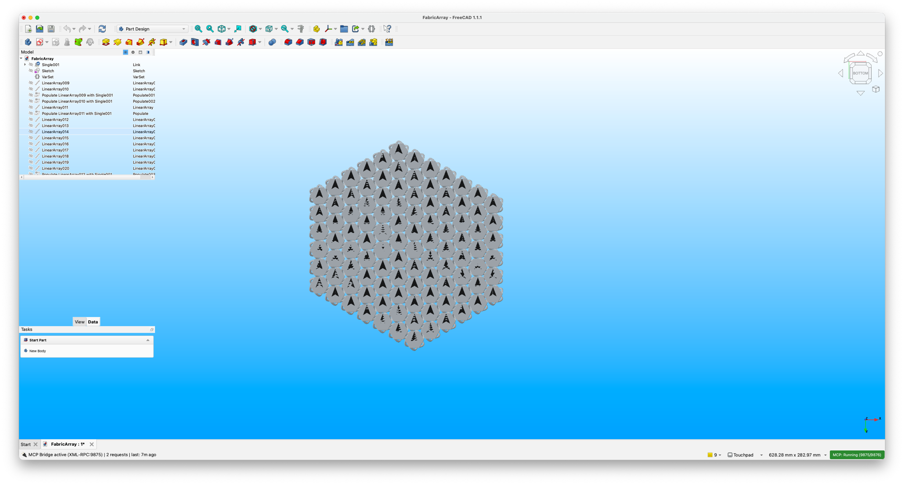

# Coaster-Chainmail

A 3D-printable chainmail-fabric coaster. Print the linked-mesh sheet in one go — the interlocking links print loose and flex like fabric.



## Files

| File | Description |
|------|-------------|
| `Coaster_Chainmail.FCStd` | Source unit — the chainmail link / cell geometry |
| `FabricArray.FCStd` | Printable sheet — array of the unit |
| `3mf/ChainMailSheet.3mf` | Slicer-ready multi-link sheet |
| `stl/FabricArray.stl` | STL mesh of the printable sheet |

## Print

Open `3mf/ChainMailSheet.3mf` in Creality Print (or your slicer of choice) and send to printer. PLA works for the test print; engineering plastics (ASA, PETG) for production / outdoor use.

## Parametric edits

Open `Coaster_Chainmail.FCStd` and/or `FabricArray.FCStd` in FreeCAD 1.1+. Adjust parametric variables via the VarSet (no raw coordinate edits — see `CLAUDE.md`).

After any FCStd change:

```bash
python3 scripts/audit_parametric.py
```

## License

See `LICENSE.txt`.
